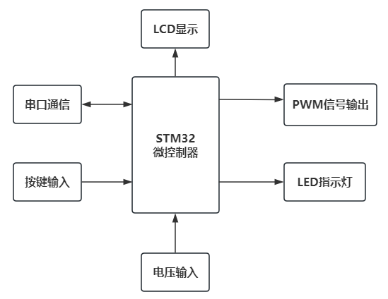
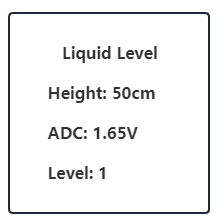

# 
  极光工作室三轮考核项目（stm32） 

## 题目01： 液位计

### 硬件框图

### 功能描述

1. 使用 STM32 微控制器 ADC 通道（PC2）测量电位器R输出的模拟电压信号V
2. 完成 KEY0、KEY1、KEY2、WK_UP 四个独立按键的动作扫描。
3. 按照显示要求，通过 LCD 显示数据和参数。
4. 通过 PB10 引脚完成频率固定为 100Hz，占空比可调节的脉冲信号输出功能。
5. 按题目要求，通过 LED 指示灯完成相关指示功能。

### 性能要求

1. 数据显示界面下电压值更新时间：<0.1秒
2. PB10输出信号占空比跟随响应时间：≤1秒；
3. 按键响应时间：≤0.1秒；
4. 输出信号频率精度要求：≤士5%；
5. 输出信号占空比精度要求：≤士5%。

### 液位检测

通过电位器R模拟液位传感器输出电压信号，设备以1秒为间隔采集R输出电压，并与用户设定的液位阈
值进行比较。假定液位高度与电位器输出电压之间具有正比例关系： ，当
时，对应液位高度为 100cm。通过液晶显示当前的液位高度、传感器（R）输出状态和液位等级，液位
检测显示界面如下图所示：

ADC 采集得到的结果应经过算术平均滤波算法处理，显示结果保留小数点后两位有效数字。

LCD 通用显示要求：

1. 显示背景色(BackColor)：黑色
2. 显示前景色(TextColor)：白色
3. 字体大小：16号字

### 液位阈值设定

设备可设定三个液位阈值，对应四个液位等级，阈值由用户通过按键输入，设备保存阈值，并根据此阈
值判断液位等级，假定用户输入的三个液位阈值为 10cm、20cm 和 30cm，液位高度与液位等级的对应
关系如下：

1. 液位高度≤10cm 时，液位等级为 0；
2. 10cm<液位高度≤20cm 时，液位等级为 1；
3. 20cm<液位高度≤30cm 时，液位等级为 2；
4. 液位高度＞30cm 时，液位等级为 3。

设备初始液位阈值分别为 30cm、50cm 和 70cm。

### 按键功能

WK_UP按键：“设置”按键，按下后进入阈值设定界面（如图2所示），再次按下WK_UP按键时退出设置
界面，保存用户设定的结果，并返回图1所示的液位检测界面。

KEY1按键：切换选择3个待修改的阈值，被选中的阈值应突出显示（字体红色）。

KEY0按键：“加”按键，按下后，被选择的阈值增加 5cm，增加到 95cm 为止。

KEY2按键：“减”按键，按下后，被选择的阈值减少 5cm，减少到 5cm 为止。

### 串口查询与输出功能

使用串口1完成以下串口功能，波特率设置为 9600。

#### 查询

通过 PC 机向设备发送字符‘C’，设备返回当前液位高度和液位等级；

通过 PC 机向设备发送字符‘S’，设备返回当前设定的三个阈值。

液位高度和等级返回数据格式举例：

>“C:H55+L2\r\n”
>
>解析：应答高度、等级查询，液位高度为 55cm，液位等级为 2。

阈值返回数据格式举例：

>“S:TL30+TM50+TH70\r\n”
>
>解析：应答阈值查询，设备内保存的三个阈值分别为 30cm、50cm 和 70cm。

#### 输出

当液位等级发生变化时，设备自动向PC机发送当前液位等级、液位高度和液位变化趋势（上升或下
降）。

输出数据格式举例：

>“A:H55+L2+D\r\n”
>
>解析：液位变化自动发送，液位高度 55cm，液位等级为 2，变化趋势下降。
>
>“A:H55+L2+U\r\n”
>
>解析：液位变化自动发送，液位高度 55cm，液位等级为 2，变化趋势上升。

### pwm输出

使用PB10输出频率固定100Hz，占空比可调节的脉冲信号。占空比与Vr的关系如下：

Vr = 3.3 * D , D为占空比

当Vr = 0V 时，PA6持续输出低电平

当Vr = 3.3V 时， PA6持续输出高电平

### LED状态指示

LED 指示灯功能定义如下：

蓝灯LED_B：运行状态指示灯，以1秒为间隔亮灭闪烁；

绿灯LED_G：液位等级变化指示灯，当液位等级发生变化时，LED_G以0.2秒为间隔闪烁5次；

红灯LED_R：通讯状态指示灯，当设备接收到查询指令时，LED_R以0.2秒为间隔闪烁5次。

### 初始状态说明

请严格按照下列要求设计作品上电后的初始状态：（未按要求-5分）

1. PB10通道输出PWM占空比10%；
2. 上电默认处于液位检测显示界面。
3. 