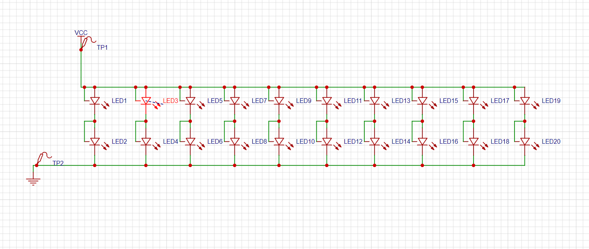
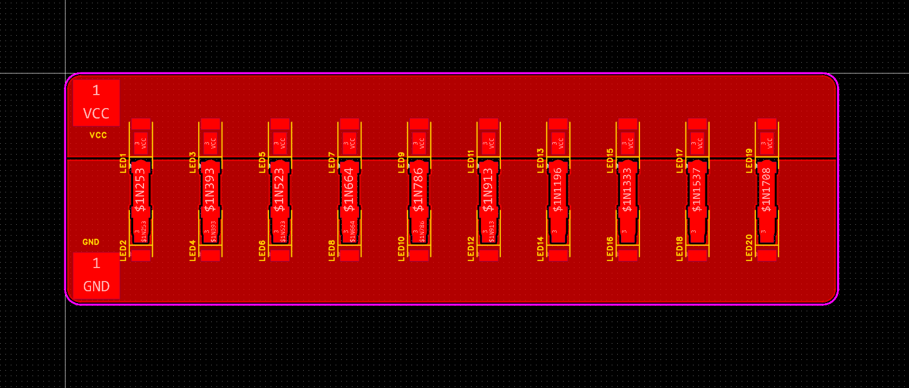

# 
  极光工作室三轮考核项目库（项目难度难度不分先后） 

## 大致介绍

&emsp;&emsp;以下的项目在难度上没有排序，所以会出现有一些简单的题目在最后头之类的情况出现。
这其中大部分的项目除了少部分上难度的题目必须要自己画板子之外，都可以通过最小系统板搭配不同的模块来实现，所以无需担心说出现完全没法做的情况，这其中用到的模块淘宝上都可以买到。

&emsp;&emsp;对于有基础的同学我们推荐去试着挑战项目库里面的难题，最后实际验收的时候是根据要求的完成情况以及答辩情况给分做判断的，所以不用担心说因为做不完而影响你能不能进工作室。我们更加欢迎有勇气去挑战困难项目的人，而不是只在自己会的范围内挑简单的来做的人，当然这不是说你无脑选择远超你可做范围的项目，项目要谨慎挑选。如果你一点电源知识都不懂的选个电源题然后最后啥都没法交上来我们也没法让你过三轮，这样做只能说你很有勇气但我个人认为这纯粹是过分高估了自己。

## 题目01：基于STM32和LCD（或OLED）显示屏的电子时钟

### 问题描述

&emsp;&emsp;设计并实现一个基于STM32微控制器和LCD（或OLED）显示屏的电子时钟，要求能使用按键设置显示时间以及闹钟设定时间。要有蜂鸣器，到达闹钟设定时间时蜂鸣器会响。

### 要求

#### 硬件要求

1. STM32f103c8t6微控制器
2. 显示屏（型号不限，分辨率要求大于128 x 64）
3. 按键输入设备
4. 蜂鸣器

#### 硬件加分项

1. 板子是自己画的（要求提供原理图以及pcb图来证明是自己画的）
2. 使用外部RTC芯片实现断电走时（如DS3231）
3. 使用VFD屏幕（你都用VFD了板子自己画去.jpg）

#### 软件要求

1. 时间使用12小时制，初始化时时间设定为11:59:50 AM （如果使用了外部RTC芯片则不用设定初始化时的时间），闹钟时间设定为 12:00:00 AM，AM与PM的切换时要求先显示12:00:00然后再切换，如： 11:59:59 AM-> 12:00:00 AM -> 01:00:01 PM
2. 到达闹钟设定时间时蜂鸣器需要响，蜂鸣器响的顺序为：1声->3声->1声->3声，间隔0.5s，上述循序结束后自动关闭蜂鸣器。在蜂鸣器未完成上述顺序时按下任意键需要能直接关闭蜂鸣器。
3. （如果不使用外部RTC芯片）需要通过按键来更改当前显示时间以及设定的闹钟时间。（如果使用了外部RTC芯片则不用更改当前显示时间，但仍要能通过按键修改设定的闹钟时间）

## 题目02：基于STM32和LCD（或OLED）显示屏的电子打字机

### 问题描述

&emsp;&emsp;设计并实现一个基于STM32微控制器和LCD（或OLED）显示屏的简易电子打字机，该打字机能够通过按键输入字符，并实时在显示屏上显示输入的内容。要求设计的系统能够处理包括字母、数字和常用标点符号在内的所有字符输入，并支持删除功能。

### 要求

#### 硬件要求

1. STM32F103C8T6微控制器
2. 显示屏（型号不限，分辨率要求大于128 x 64）
3. 按键输入设备（可以是矩阵键盘或多个独立按键，但要求键盘至少有完整的26个字母，常用的标点符号以及大小写控制键）

#### 硬件加分项

1. 板子自己画
2. 搓出完整的87键或98键键盘（通常来讲能这样做板子肯定自己画.jpg）
3. 使用机械轴（？）

#### 软件要求

1. 实现字符输入并在显示屏上显示。
2. 支持的字符集包括：大小写字母（A-Z, a-z）、数字（0-9）和常用标点符号（如.,!?）。
3. 提供清屏功能，一键清除当前显示内容。
4. 支持输入模式切换，如大写锁定、小写锁定等。
5. 在 OLED 显示屏显示的内容达到屏幕边界时，自动换行或者不显示前面超出范围的字符。

#### 软件加分项

1. 提供删除功能，能够删除光标前的一个字符。
2. 实现光标功能，能够在输入时实时显示光标位置。
3. 实现简单的文本编辑功能，如光标移动。

## 题目03：基于STM32和LCD（或OLED）的小型气象站

### 问题描述

&emsp;&emsp;设计并实现一个基于STM32微控制器和LCD（或OLED）显示屏的小型气象站，可以使用传感器模块，要求能实时测量并显示温度，湿度和大气压强

### 要求

#### 硬件要求

1. STM32F103C8T6微控制器
2. 显示屏（型号不限，分辨率要求大于128 x 64）
3. 温度湿度传感器模块（如DHT22），大气压强模块（如bmp280）

#### 硬件加分项

1. 自己画板
2. 自己画板的同时直接使用相应的传感器芯片而不是使用传感器模块

#### 软件要求

1. 显示屏能实时显示当前温度，湿度和大气压，若选择的显示屏大小不够同时显示三个数值的可做自动轮流切换或者提供外部按钮来进行切换

#### 软件加分项

1. 不使用传感器给出的官方库而是自己写驱动库

## 题目04：基于STM32和LCD（或OLED）的计算器（基础版本）

### 问题描述

&emsp;&emsp;设计并实现一个基于STM32微控制器和LCD（或OLED）显示屏的四则运算计算器，要求实现加减乘除四则运算

#### 硬件要求

1. STM32F103C8T6微控制器
2. 显示屏（型号不限，分辨率要求大于128 x 64）
3. 按键输入设备（可以是矩阵键盘或多个独立按键，但要求键盘至少有数字0~9以及 + - * / = 五个按键，还有清零，可以加上小括号，能加分）

#### 硬件加分项

&emsp;&emsp;老样子，自己画板

#### 软件要求

1. 能正确执行输入的算式
2. 符合运算符优先级（不要违反数学规律.jpg）
3. 按下清零键之后清空屏幕

#### 软件加分项

1. 能保存历史记录并通过设置额外的按键查看历史记录
2. 历史记录能掉电保存
3. 能计算带括号的算式（多级计算详见[后缀表达式（逆波兰表达式，也叫RPN表达式）](https://oi-wiki.org/misc/expression/)）

## 题目05：基于STM32和LCD（或OLED）的计算器（科学计算版本）

### 问题描述

&emsp;&emsp;设计并实现一个基于STM32微控制器和LCD（或OLED）显示屏的计算器，要求能计算三角函数，幂函数，开根，绝对值以及log函数（默认以e为底）

#### 硬件要求

1. STM32F103C8T6微控制器
2. 显示屏（型号不限，分辨率要求大于128 x 64）
3. 按键输入设备（可以是矩阵键盘或多个独立按键，必须有小括号，以及问题描述里面要求计算的所有东西）

#### 硬件加分项

&emsp;&emsp;老样子，自己画板

#### 软件要求

1. 能正确执行输入的算式
2. 符合运算符优先级（不要违反数学规律.jpg）
3. 按下清零键之后清空屏幕
4. 能计算带括号的算式（多级计算详见[后缀表达式（逆波兰表达式，也叫RPN表达式）](https://oi-wiki.org/misc/expression/)）

#### 软件加分项

1. 能保存历史记录并通过设置额外的按键查看历史记录
2. 历史记录能掉电保存

## 题目06：使用STM32和LCD（或OLED）屏幕以及扬声器播放bad apple

### 问题描述

&emsp;&emsp;我觉得题目本身已经说的很清楚了没必要这也说一遍.jpg

&emsp;&emsp;(因为感觉单纯播视频太简单了一点，网上一坨代码直接cv过来就能用所以加上了音频.jpg)

### 要求

#### 硬件要求

1. STM32F103C8T6微控制器
2. 显示屏（型号不限，分辨率要求大于320 x 240，物理大小最好超过4寸）
3. 帧率超过12fps
4. 音频输出模块（基础要求不高但至少采样深度要超过8bit）（可以试着自己搓）

#### 硬件加分项

1. Hi-Res 音频！（划去）（具体指标为 24bit 96KHz）
2. 输出音频达到 44.1KHz 16bit
3. 帧率超过30fps
4. 视频本地存储（写进flash或者外挂sd卡都行，不过视频本地存储好像比通过usb传输更简单一点？）

#### 软件要求（好像上面硬件都列完了.jpg）

1. 使用u8g2图形库

## 题目07：使用STM32播放bad apple，但是是示波器

### 问题描述

&emsp;&emsp;看着很难对吧（

&emsp;&emsp;其实比上一题简单多了.jpg

&emsp;&emsp;具体使用的音频的生成并不在考核范围内（废话），如果对相应的知识感兴趣的话可以浏览 [此github仓库](https://github.com/chdilo/BadAppleOSC)，该题目实际要做的是让你们使用stm32驱动一个3.5mm耳机.jpg

&emsp;&emsp;示波器由工作室来出，型号为普源的DS1102Z-E

### 要求

#### 硬件要求

1. STM32F103C8T6微控制器
2. 能接受i2s输入的音频模块一个（买前注意检查音频模块的参数，参数必须大于等于 16bit 44.1KHz）

## 题目08：一个基于STM32的2.4G无线收发模块

### 问题描述

&emsp;&emsp;使用两片mcu以及无线收发模块进行相互数据传输，需要使用电脑作为mcu的上位机，电脑发送数据给mcu然后mcu通过2.4G转发给另外一个mcu，另外一个mcu需要将接收到的数据显示出来（回传给上位机显示或者使用外置屏幕显示）

&emsp;&emsp;（注意配置发送速率以及考虑空中数据包冲突）

### 要求

#### 硬件要求

1. 两片STM32F103C8T6微控制器
2. 两个2.4G无线收发模块（可用亿佰特的[E01-2G4M27D](https://www.ebyte.com/product/449.html)或者[E28-2G4M27SX](https://www.ebyte.com/product/1920.html)）
3. LCD或OLED显示屏（可选）

## 题目09：电子时钟升级版

### 问题描述

&emsp;&emsp;与前面的电子时钟要求差不多相同，但限制必须使用外置RTC芯片，屏幕使用VFD屏幕（型号自选，推荐使用[ST-13-84GINK](http://e.tb.cn/h.gsltCs2305vQEJK?tk=SPCv3RxFqRh)），板子自画，电源使用18650电池供电或者usb 5v供电，推荐使用电池，因为能加分

## 题目10（模数结合）使用STM32配合ADC芯片制作usb功耗计（简单版）

### 问题描述

&emsp;&emsp;该题为简单版本，只需要使用ADC测出线路电压即可

### 硬件要求

1. STM32F103C8T6微控制器
2. ADC，型号自选（推荐选择性能大于或等于[ADS1115](https://www.ti.com.cn/product/cn/ADS1115)的芯片）
3. 屏幕，型号以及类型自选，要求至少能一次性显示所有要求显示的数值（在这是显示线路电压）
4. 接口均为usb type-c接口
5. 不可断开d+ d-等数据线

### 硬件加分项

1. 支持快充（即宽电压输入范围，通常为5v~28v）（ADC选型时请注意芯片的供电范围以及io口最大电压容忍上线）

## 题目11（模数结合）使用STM32配合ADC芯片制作usb功耗计（完整版）

### 问题描述

&emsp;&emsp;要求能测出线路电压，电流，支持快充

### 性能要求

1. 电压，电流范围： 3.3v~30v 0~5A
2. 测量误差不超过1%

## 题目12（硬件）DC-DC电路（简单版本）

### 题目描述

&emsp;&emsp;制作一个DC-DC模块，可以输出一个固定电压，输入可在一定范围内变化，负载变化时电压基本不变。

### 要求

1. 实现方法不限，包括但不限于DC-DC芯片，单片机实现数字电源，运放模拟电源仙人等等。
2. 拓扑不限，包括但不限于Buck, Boost, Buck-Boost,   Sepic等等。
3. 输入电压越宽越好，输出电压合理。
4. 在50%负载的设计指标时，效率不低于80%，负载调整率不超过5%，纹波越小越好。
5. 不能上交购买的成品模块，需要实物，原理图，pcb。

### 补充说明

1. 如果使用芯片制作，可以参考datasheet中的指南，以及相关参数。
2. 建议使用TI,MPS的芯片，datasheet内有详细的设计指南，可以作为设计时的参考。
3. 以下附上一些网站：
   1. [半岛小芯](https://www.semiee.com/)
   2. [低压非隔离DCDC开关稳压器设计](https://www.emoe.xyz/non-isolated-dc-dc-power-regulator-schematic-design/)
   3. [模拟 | 嵌入式处理 | 半导体公司 | 德州仪器 TI.com.cn](https://www.ti.com.cn/)
   4. [英飞凌——半导体与系统解决方案 - Infineon Technologies](https://www.infineon.com/cms/cn/)

## 题目13（硬件）DC-DC电路（进阶版）

&emsp;&emsp;制作一个DC-DC模块，可以输出电压可变，输入可在一定范围内变化，负载变化时电压基本不变。

### 要求

1. 实现方法不限，包括但不限于DC-DC芯片，单片机实现数字电源，运放模拟电源仙人等等。
2. 拓扑不限，包括但不限于Buck, Boost, Buck-Boost,   Sepic等等。
3. 输入电压越宽越好，输出电压合理可调。
4. 在50%负载的设计指标时，效率不低于90%，输入， 输出负载调整率不超过5%，纹波100mV以内。
5. 不能上交购买的成品模块，需要实物，原理图，pcb。

## 题目14（硬件带单片机）点亮一个LED（灯板）

### 灯板参数

&emsp;&emsp;灯珠为[HL-A-5730D1W-S1-08-HR3](https://item.szlcsc.com/211249.html?fromZone=s_s__%2522C210349%2522)，采用2串10并的接法，原理图以及pcb如下

原理图

pcb

### 硬件要求

1. 支持调光，最好为DC调光
2. 使用stm32作为主控IC（即stm32发出调光信号给到LED控制IC，如pwm波形之类的）
3. 使用电池供电（作为加分项）
4. led驱动芯片可用[SY7203](https://item.szlcsc.com/137174.html)

## 题目15（硬件）点亮一个LED（灯板）

### 灯板参数

&emsp;&emsp;灯珠为[HL-A-5730D1W-S1-08-HR3](https://item.szlcsc.com/211249.html?fromZone=s_s__%2522C210349%2522)，采用2串10并的接法

### 硬件要求

1. 支持调光，最好为DC调光
2. 不依靠单片机生成调光用pwm波形（比如使用[GP9101](https://item.szlcsc.com/3010518.html)之类的）
3. 使用电池供电（作为加分项）

## 题目16：搓一个电子电压表（简单版）

### 题目描述

&emsp;&emsp;使用STM32配合ADC搓一个可以测量电压的电压表，可以直接使用STM32的内置ADC（但不大推荐）

### 硬件要求

1. STM32F103C8T6微控制器
2. 显示屏（型号不限，分辨率要求大于128 x 64）
3. ADC（比如ADS1115，简单版项目也能直接使用mcu内置的ADC）

### 测量范围

&emsp;&emsp;电压测量范围为：0v~3.3v

## 题目17 搓一个电子电压表（完整版）

### 硬件要求

1. STM32F103C8T6微控制器
2. 显示屏（型号不限，分辨率要求大于128 x 64）
3. 外置ADC（比如ADS1115）

### 测量范围

&emsp;&emsp;电压测量范围为： 0v~40v

## 题目18 超声波测距

### 题目描述

&emsp;&emsp;要求使用STM32配合超声波测距模块完成对指定方向障碍物的测距（范围至少50cm开外）

### 硬件要求

1. STM32F103C8T6微控制器
2. 显示屏（型号不限，分辨率要求大于128 x 64）（将测算出来的距离显示在显示屏上）
3. 超声波测距模块（要求至少能测量50cm开外）

### 软件要求

1. 两次测距间不设置间隔，在一次测距完成后立刻启动第二次测距
2. 测量出来的距离要实时显示在显示屏上

### 加分项

1. 能使用步进电机或舵机完成对前方180度扇形区域的障碍物扫描（就像雷达那样）
2. 能使用步进电机或舵机完成对周边360度全方向的障碍物扫描（就像雷达那样）

## 题目19 激光测距

### 题目描述

&emsp;&emsp;与上一题要求相同，但超声波测距模块换成激光测距模块

## 结尾

&emsp;&emsp;祝各位能正确选择适合自己的项目并且通过三轮考核。我希望各位在完成项目的时候不要以通过三轮考核为目标去做，而是以提升自己嵌入式的经验为目标去做。就算最后没通过三轮考核也不要灰心丧气，这并不代表你不适合走上嵌入式这一条道路，只是可能竞争者里面有比你更努力学习的人。只要你对嵌入式感兴趣（不管你是对软件还是硬件感兴趣），肯花时间在这个爱好上，那我相信你绝对不会比进了工作室的人要差的。只要你是对嵌入式感兴趣的那我们都可以成为志同道合的朋友，不管你到底有没有进工作室。

三轮项目库编写者：谢伟力

联系方式： 3064561709（qq） kaizen-857（微信）

&emsp;&emsp;有任何在硬件上不懂的地方，都可以来问工作室的各位学长学姐，虽然我们没法保证24小时在线，但学弟学妹们的疑惑我们都会尽自己最大的力去解决 ~~（当然更欢迎学妹来加我们哦）~~

&emsp;&emsp;（过完二轮后吐槽：怎么全是男的（（（（
